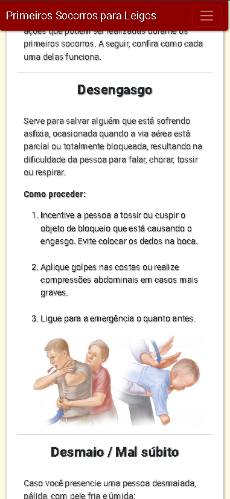
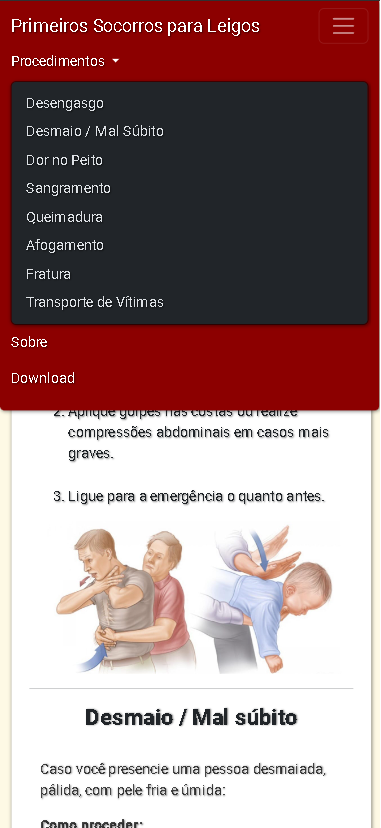
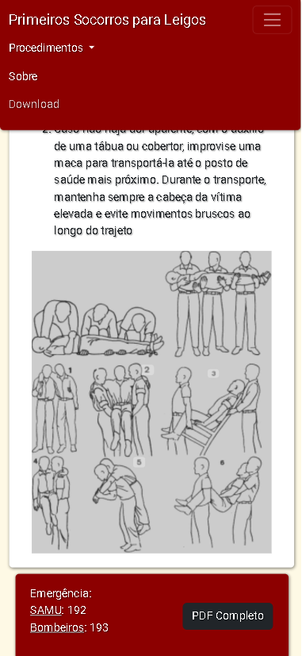

# Primeiros Socorros para Leigos

  > Nosso objetivo é fornecer informações essenciais e acessíveis sobre primeiros socorros para ajudar qualquer pessoa a responder de maneira eficaz em situações de emergência. 
  > O conhecimento de primeiros socorros pode ser a diferença entre a vida e a morte em muitos casos. Este guia foi criado para capacitar pessoas comuns com as habilidades necessárias para agir de forma rápida e correta em uma emergência.

- Link do Deploy [Aqui](https://feliphe-blatt.github.io/primeiros-socorros/)

  

## Funcionalidades

- Informações detalhadas sobre primeiros socorros
- Instruções passo a passo para diversos procedimentos
- Acesso a números de emergência e download de PDF com todos os procedimentos

## Tecnologias Utilizadas

- HTML5
- CSS3
- JavaScript
- Bootstrap 5

### Equipe do Projeto

- **Feliphe Blatt**
    - Perfil do GitHub [Aqui](https://github.com/feliphe-blatt)
       
      
      
- **Cristiane Nunes**
    - Perfil do GitHub [Aqui](https://github.com/cristiane-nunes-git)
       
      
      
- **Raíssa Cavalcanti**
    - Perfil do GitHub [Aqui](https://github.com/Raissa2308)
       
      

## Licença

Este projeto está licenciado sob a [MIT License](LICENSE).
